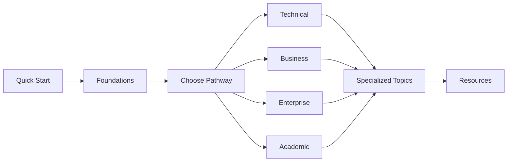

# BSV Knowledge Base Navigation Guide

## How to Use This Universal Resource Effectively

This guide helps you navigate the BSV Knowledge Base efficiently, find what you need quickly, and make the most of all available resources.

## 🗺️ Resource Map

### Overall Structure

```
BSV Universal Knowledge Base
│
├── 00-welcome/                 ← You are here
│   ├── Universal Overview      ← Complete ecosystem map
│   ├── Quick Wins             ← Immediate value
│   └── Navigation Guide       ← This guide
│
├── 01-getting-started/        ← Hands-on introduction
│   ├── Wallet Setup          ← First step for everyone
│   ├── Examples              ← Code samples
│   └── Live Demos           ← See BSV in action
│
├── 02-foundations/           ← Core concepts
│   ├── BSV Evolution        ← History and vision
│   ├── Core Concepts       ← Essential knowledge
│   └── Why BSV            ← Key advantages
│
├── 03-learning-pathways/    ← Specialized tracks
│   ├── Technical          ← For developers
│   ├── Business          ← For decision makers
│   ├── Enterprise       ← For architects
│   └── Academic        ← For researchers
│
├── 04-specialized-topics/  ← Deep dives
│   ├── Privacy & Identity ← Advanced privacy
│   ├── sCrypt Development ← Smart contracts
│   └── Implementation    ← Deployment guides
│
├── 05-hackathon-pack/     ← Rapid development
├── 06-resources/         ← Tools & references
├── 07-assessments/      ← Test knowledge
├── 08-ecosystem/       ← Component details
├── 09-reference/      ← Technical library
└── 10-system-overview/ ← Architecture guide
```

## 🎯 Finding What You Need

### By User Type

#### I'm a Developer
1. Start: `01-getting-started/` → Get wallet, run examples
2. Learn: `03-learning-pathways/technical/` → Build applications
3. Reference: `06-resources/` → APIs and tools
4. Advanced: `04-specialized-topics/scrypt-development/` → Smart contracts

#### I'm a Business Person
1. Start: `00-welcome/quick-wins.md` → See immediate value
2. Learn: `03-learning-pathways/business/` → Understand benefits
3. Implement: `03-learning-pathways/business/implementation-guide.md`
4. Case Studies: `03-learning-pathways/business/case-studies.md`

#### I'm an Enterprise Architect
1. Overview: `00-welcome/universal-overview.md` → System understanding
2. Architecture: `03-learning-pathways/enterprise/` → Design patterns
3. Compliance: `03-learning-pathways/enterprise/regulatory-compliance.md`
4. Deploy: `03-learning-pathways/enterprise/deployment-strategies.md`

#### I'm a Researcher/Student
1. Theory: `02-foundations/` → Conceptual foundation
2. Academic: `03-learning-pathways/academic/` → Formal education
3. Papers: `09-reference-library/whitepapers/` → Research materials
4. Advanced: `04-specialized-topics/` → Cutting-edge topics

### By Goal

#### "I want to build something quickly"
→ `05-hackathon-pack/` - Templates and quick starts

#### "I need to understand the business case"
→ `03-learning-pathways/business/value-propositions/` - Industry solutions

#### "I'm evaluating BSV vs other blockchains"
→ `02-foundations/why-bsv.md` - Comparative advantages

#### "I need enterprise compliance info"
→ `03-learning-pathways/enterprise/regulatory-compliance.md`

#### "I want to learn about privacy"
→ `04-specialized-topics/privacy-identity/` - Complete privacy course

## 🔍 Search Strategies

### Using Search (Ctrl/Cmd + K)
- **Exact phrases**: Use quotes "merkle proof"
- **Categories**: Add context "enterprise security"
- **Code**: Search for functions "createTransaction"
- **Concepts**: Use keywords "micropayments"

### Effective Keywords
- **Technical**: SDK, API, wallet, transaction, UTXO
- **Business**: ROI, case study, value proposition
- **Enterprise**: compliance, architecture, integration
- **Academic**: theory, cryptography, distributed

## 📚 Learning Paths

### Fast Track (1 day)
1. `00-welcome/` - Overview (30 min)
2. `01-getting-started/` - Hands-on (2 hours)
3. `Your pathway/` - Focused learning (4 hours)
4. `05-hackathon-pack/` - Build something (2 hours)

### Comprehensive (2-4 weeks)
1. Complete foundations
2. Full pathway content
3. Specialized topics
4. Assessments
5. Real project

### Reference Mode
- Jump directly to needed sections
- Use search extensively
- Bookmark frequently used pages
- Create your own index

## 🔄 Cross-References

### Common Navigation Patterns



### Related Content Links
Each section includes:
- **Prerequisites**: What to read first
- **Next Steps**: Where to go next
- **See Also**: Related topics
- **Examples**: Practical applications

## 💡 Navigation Tips

### 1. Use the Table of Contents
- Available on every page
- Shows current location
- Quick section jumping

### 2. Breadcrumb Navigation
- Shows your path
- Easy backtracking
- Context awareness

### 3. Progressive Disclosure
- Start with overviews
- Dive deeper as needed
- Skip advanced initially

### 4. Multiple Entry Points
- No single "correct" path
- Enter where relevant
- Cross-reference freely

## 📱 Mobile Navigation

### Touch Gestures
- Swipe for next/previous
- Pinch to zoom diagrams
- Tap to expand sections

### Mobile-Optimized
- Responsive design
- Readable on small screens
- Touch-friendly links

## ⌨️ Keyboard Shortcuts

| Shortcut | Action |
|----------|--------|
| `Ctrl/Cmd + K` | Search |
| `Ctrl/Cmd + P` | Quick navigation |
| `G` then `H` | Go home |
| `G` then `S` | Go to getting started |
| `?` | Show all shortcuts |

## 🔖 Bookmarking Strategy

### Essential Bookmarks
1. This navigation guide
2. Your primary pathway
3. Quick reference pages
4. Frequently used tools

### Organization Tips
- Create folders by project
- Tag by topic
- Update regularly
- Share with team

## 📊 Progress Tracking

### Track Your Learning
- [ ] Welcome section complete
- [ ] Getting started done
- [ ] Foundations understood
- [ ] Pathway chosen
- [ ] First project built
- [ ] Advanced topics explored

### Skill Progression
1. **Beginner**: Getting started, basic concepts
2. **Intermediate**: Building applications
3. **Advanced**: Architecture, optimization
4. **Expert**: Contributing back

## 🆘 Getting Help

### Can't Find Something?
1. Use search first
2. Check the index
3. Ask in Discord
4. Submit feedback

### Navigation Issues?
- Report broken links
- Suggest improvements
- Request new content
- Share your experience

## 🎯 Quick Navigation Links

### Most Visited Pages
- [Wallet Setup](../01-getting-started/wallet-setup.md)
- [Technical Overview](../03-learning-pathways/technical/README.md)
- [Business Value](../03-learning-pathways/business/README.md)
- [Quick Wins](quick-wins.md)
- [Live Demos](../01-getting-started/live-demos.md)

### Quick References
- [API Documentation](../06-resources/api-references/)
- [Code Examples](../01-getting-started/examples.md)
- [Troubleshooting](../06-resources/troubleshooting.md)
- [Community Links](../06-resources/community.md)

---

**Remember**: This knowledge base is designed to be explored non-linearly. Jump around, follow your interests, and build your understanding progressively. The best path is the one that helps you achieve your goals!