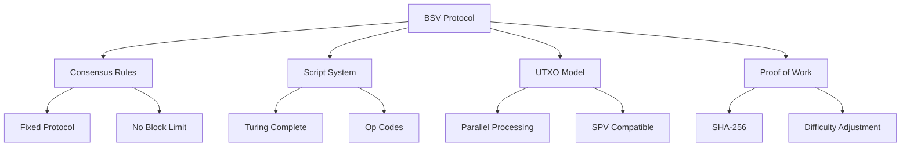
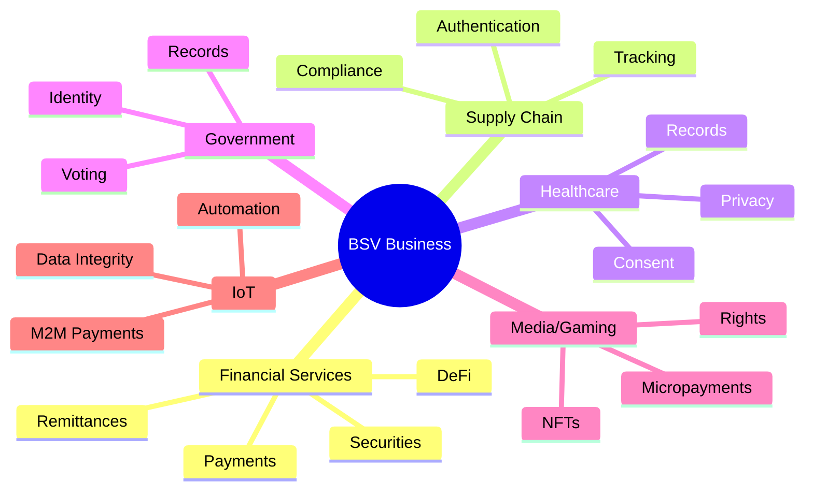

# BSV Universal Ecosystem Overview

## Complete Map of the BSV Universe

This comprehensive overview provides a complete picture of the BSV ecosystem, its components, stakeholders, and how everything connects together.

## 🏗️ Core Infrastructure

### Protocol Layer
The foundation of BSV - the original Bitcoin protocol maintaining Satoshi's vision.



### Network Components

#### 1. **Nodes**
- **SV Node**: Current production node implementation
- **Teranode**: Next-generation node for massive scale
- **SPV Servers**: Light client infrastructure

#### 2. **Mining Infrastructure**
- **Mining Pools**: Distributed hash power
- **ASIC Miners**: Specialized hardware
- **Mining Software**: Stratum servers and protocols

#### 3. **Service Infrastructure**
- **mAPI**: Merchant API for direct miner access
- **Overlay Services**: Specialized business logic layers
- **Header Services**: Block header distribution

## 🛠️ Development Ecosystem

### SDKs and Libraries

| Language | SDK | Use Case |
|----------|-----|----------|
| **TypeScript/JavaScript** | @bsv/sdk | Web and Node.js applications |
| **Python** | py-bsv-sdk | Data science and scripting |
| **Go** | go-sdk | High-performance services |
| **Java** | java-sdk | Enterprise applications |
| **C++** | libsv | System-level integration |

### Development Tools

#### Smart Contract Development
- **sCrypt**: High-level smart contract language
- **Script Debugger**: Transaction script analysis
- **Transaction Builder**: Visual transaction construction

#### Wallet Development
- **Key Management**: HD wallet implementations
- **Transaction Creation**: UTXO management
- **SPV Implementation**: Light client verification

#### Testing Tools
- **Regtest Network**: Local blockchain
- **Testnet**: Public test network
- **WhatsOnChain**: Blockchain explorer

## 💼 Business Solutions

### Industry Applications



### Enterprise Features

1. **Compliance Ready**
   - Full transaction traceability
   - AML/KYC compatibility
   - Regulatory reporting

2. **Scalability**
   - Unlimited transaction throughput
   - Predictable fee structure
   - Parallel processing capability

3. **Integration**
   - REST APIs
   - WebSocket streams
   - Enterprise message queues

## 🌐 Standards and Protocols

### Transaction Standards
- **BRC-1**: Transaction Specification
- **BRC-2**: Envelope Specification
- **BRC-3**: Merkle Proof Standard
- **BRC-42**: Payload Signatures

### Application Protocols
- **Paymail**: Human-readable payment addresses
- **MetaNet**: On-chain internet protocol
- **tokenized**: Asset issuance protocol
- **Run**: Token protocol

### Data Protocols
- **B://**: Bitcoin data protocol
- **C://**: Content addressable storage
- **D://**: Dynamic state protocol

## 👥 Ecosystem Participants

### Core Infrastructure
- **BSV Association**: Protocol stewardship
- **nChain**: Research and development
- **TAAL**: Mining and infrastructure
- **GorillaPool**: Mining operations

### Service Providers
- **WhatsOnChain**: Block explorer
- **MoneyButton**: Payment processor
- **HandCash**: Consumer wallet
- **Centbee**: Mobile wallet
- **ElectrumSV**: Desktop wallet

### Development Organizations
- **sCrypt Inc**: Smart contract tools
- **Vaionex**: Development services
- **BitBoss**: Gaming solutions
- **Tokenized**: Asset platform

## 📊 Network Statistics

### Current Capabilities
- **Block Size**: Unlimited (4GB+ demonstrated)
- **Transaction Fee**: < $0.001 per transaction
- **Throughput**: 50,000+ TPS demonstrated
- **Op Return Size**: Unlimited data storage

### Growth Metrics
- Active addresses
- Daily transactions
- Data stored on-chain
- Application diversity

## 🎯 Use Case Categories

### 1. **Micropayments**
- Content monetization
- API payments
- Gaming transactions
- IoT payments

### 2. **Data Management**
- Immutable records
- Audit trails
- Compliance data
- Scientific data

### 3. **Digital Assets**
- Tokens
- NFTs
- Securities
- Certificates

### 4. **Identity Solutions**
- Self-sovereign identity
- Credential management
- Access control
- Privacy preservation

### 5. **Smart Contracts**
- Automated agreements
- Escrow services
- Conditional payments
- Complex business logic

## 🔄 Integration Patterns

### Application Architecture

```
┌─────────────────┐     ┌─────────────────┐
│   Application   │────▶│   BSV Wallet    │
└────────┬────────┘     └────────┬────────┘
         │                       │
         ▼                       ▼
┌─────────────────┐     ┌─────────────────┐
│ Overlay Service │────▶│   BSV Network   │
└────────┬────────┘     └────────┬────────┘
         │                       │
         ▼                       ▼
┌─────────────────┐     ┌─────────────────┐
│   Data Layer    │────▶│   Miners/Nodes  │
└─────────────────┘     └─────────────────┘
```

### Common Patterns
1. **SPV Wallet Integration**: Light client verification
2. **Overlay Services**: Business logic layers
3. **Data Indexing**: Efficient data retrieval
4. **Payment Channels**: High-frequency transactions

## 🚀 Getting Started Paths

### For Developers
1. Install SDK for your language
2. Set up development wallet
3. Connect to testnet
4. Build first application
5. Deploy to mainnet

### For Businesses
1. Identify use case
2. Evaluate ROI
3. Pilot project
4. Scale solution
5. Measure results

### For Enterprises
1. Architecture review
2. Compliance assessment
3. Integration planning
4. Security audit
5. Phased deployment

## 📈 Future Roadmap

### Technical Evolution
- **Teranode**: Unlimited scale
- **IPv6 Integration**: Direct peer connections
- **Enhanced SPV**: Better light clients
- **Overlay Networks**: Specialized services

### Ecosystem Growth
- More development tools
- Industry-specific solutions
- Regulatory frameworks
- Global adoption

## 🔗 Key Resources

### Technical
- [BSV Wiki](https://wiki.bitcoinsv.io)
- [Technical Standards](https://tsc.bitcoinassociation.net)
- [Developer Documentation](https://docs.bitcoinsv.io)

### Business
- [BSV for Business](https://bitcoinsv.com/business)
- [Case Studies](https://bitcoinsv.com/case-studies)
- [Enterprise Solutions](https://bitcoinsv.com/enterprise)

### Community
- [BSV Discord](https://discord.gg/bsv)
- [BSV Forum](https://bitcoinsv.io/forum)
- [Developer Slack](https://bsvdevs.slack.com)

---

This overview provides a complete map of the BSV ecosystem. For detailed information on any component, follow the links or explore the relevant sections of this knowledge base.