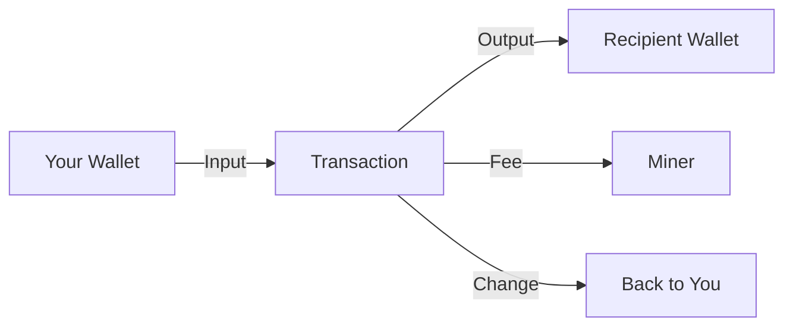

# Your First BSV Transaction

## Send and Receive BSV in Minutes

Making your first transaction is an important milestone. This guide walks you through sending and receiving BSV, understanding fees, and verifying transactions.

## 🚀 Quick Start: Send BSV

### Prerequisites
- ✅ BSV wallet installed ([Setup Guide](wallet-setup.md))
- ✅ Some BSV in your wallet
- ✅ Recipient's BSV address

### Step 1: Open Send Function

In your wallet:
1. Click "Send" or "Transfer"
2. You'll see a form with fields for:
   - Recipient address
   - Amount to send
   - Transaction fee (usually automatic)

### Step 2: Enter Transaction Details

```
Recipient: 1A1zP1eP5QGefi2DMPTfTL5SLmv7DivfNa
Amount: 0.001 BSV
Fee: 0.00000200 BSV (automatic)
```

**Pro tip**: Always double-check the address!

### Step 3: Review and Confirm

Your wallet will show:
- Total amount (including fee)
- Recipient details
- Estimated confirmation time

Click "Send" to broadcast the transaction.

### Step 4: Transaction Confirmation

You'll receive:
- Transaction ID (TXID)
- Link to block explorer
- Confirmation status

**That's it!** Your first transaction is complete.

## 📥 Receiving BSV

### Generate Receive Address

1. Click "Receive" in your wallet
2. Your wallet generates a new address
3. Share this address with the sender

```
Your address: 1BvBMSEYstWetqTFn5Au4m4GFg7xJaNVN2
```

### Address Formats

BSV supports multiple address formats:

| Format | Example | Use Case |
|--------|---------|----------|
| **Legacy** | `1A1zP1...` | Traditional Bitcoin format |
| **Paymail** | `name@domain.com` | Human-readable addresses |
| **Handle** | `$username` | Social payment handles |

### Best Practices for Receiving

1. **Use new addresses** for each transaction (privacy)
2. **Verify amount** before considering payment complete
3. **Wait for confirmations** for large amounts
4. **Save transaction records** for accounting

## 💡 Understanding BSV Transactions

### Transaction Components



### What Happens When You Send

1. **Wallet creates transaction**
   - Selects inputs (your coins)
   - Creates outputs (recipient + change)
   - Signs with your private key

2. **Broadcast to network**
   - Sent to BSV nodes
   - Propagates across network
   - Enters mempool

3. **Mining and confirmation**
   - Miners include in block
   - Block is mined
   - Transaction confirmed

## 📊 Transaction Fees Explained

### Fee Structure

BSV fees are incredibly low:
- **Typical fee**: 1 satoshi/byte
- **Average transaction**: ~250 bytes
- **Total cost**: ~250 satoshis ($0.0001)

### Fee Calculation

```javascript
// Fee calculation example
const txSize = 250; // bytes
const feeRate = 1; // satoshi per byte
const totalFee = txSize * feeRate; // 250 satoshis
const feeInBSV = totalFee / 100000000; // 0.00000250 BSV
```

### When to Adjust Fees

- **Standard transactions**: Use default (1 sat/byte)
- **Large data**: May need higher fee
- **Priority processing**: Slightly higher fee
- **Testnet**: Often zero fee

## 🔍 Verifying Transactions

### Using Block Explorers

Check your transaction on:
- [WhatsOnChain](https://whatsonchain.com)
- [BlockChair](https://blockchair.com/bitcoin-sv)
- [BSVData](https://bsvdata.com)

### What to Look For

1. **Transaction ID**: Unique identifier
2. **Confirmations**: Number of blocks
3. **Inputs/Outputs**: Transaction flow
4. **Fee**: Amount paid to miners
5. **Block Height**: Which block includes it

### Transaction States

| State | Meaning | Action |
|-------|---------|--------|
| **Unconfirmed** | In mempool | Wait |
| **1 Confirmation** | In latest block | Small amounts OK |
| **6+ Confirmations** | Deep in chain | Fully secure |

## 🎯 Common Transaction Types

### 1. Simple Payment
```
Input: Your coins
Output: Recipient + Change
Use: Regular transfers
```

### 2. Data Transaction
```
Input: Your coins
Output: OP_RETURN data + Change
Use: Storing data on-chain
```

### 3. Multi-Output
```
Input: Your coins
Output: Multiple recipients + Change
Use: Batch payments
```

### 4. Token Transaction
```
Input: Your coins + tokens
Output: Token transfer + Change
Use: Digital asset transfers
```

## 💻 Programmatic Transactions

### Using the SDK

```javascript
// Create a simple transaction
const { Transaction, PrivateKey } = require('@bsv/sdk');

// Create transaction
const tx = new Transaction();

// Add input (your UTXO)
tx.from(utxo);

// Add output (recipient)
tx.to('1A1zP1eP5QGefi2DMPTfTL5SLmv7DivfNa', 50000);

// Sign transaction
tx.sign(privateKey);

// Broadcast
const txid = await tx.broadcast();
console.log('Transaction ID:', txid);
```

### Transaction Builder Pattern

```javascript
const payment = await wallet
  .createTransaction()
  .to(recipientAddress, amount)
  .withFee(feeRate)
  .withData(['Hello', 'BSV'])
  .sign()
  .broadcast();
```

## 🔒 Security Considerations

### Before Sending

- [ ] Verify recipient address (check twice!)
- [ ] Confirm amount is correct
- [ ] Check fee is reasonable
- [ ] Ensure sufficient balance

### After Sending

- [ ] Save transaction ID
- [ ] Monitor confirmations
- [ ] Keep records for taxes
- [ ] Verify recipient received

### Common Mistakes to Avoid

1. **Wrong address** - Always copy/paste
2. **Wrong amount** - Check decimal places
3. **Insufficient fee** - Use recommended
4. **No backup** - Save transaction records

## 📈 Advanced Transaction Features

### Payment Channels
For high-frequency transactions:
- Open channel once
- Many transactions off-chain
- Close channel to settle

### Atomic Swaps
Exchange different assets:
- Trustless exchange
- No intermediary
- Automatic execution

### Time-Locked Transactions
Scheduled payments:
- Future-dated transactions
- Conditional releases
- Escrow services

## 🎓 Practice Exercises

### Exercise 1: Test Transaction
1. Get testnet BSV from faucet
2. Send to yourself
3. Verify on explorer
4. Check wallet balance

### Exercise 2: Data Transaction
1. Create message transaction
2. Store "Hello BSV" on-chain
3. Find it on explorer
4. Decode the message

### Exercise 3: Multi-Output
1. Create transaction with 3 outputs
2. Send to different addresses
3. Calculate total fees
4. Verify all received

## 🆘 Troubleshooting

### Transaction Not Confirming
- Check fee amount
- Verify network connectivity
- Wait for next block
- Contact wallet support

### Balance Not Updating
- Refresh wallet
- Check transaction status
- Verify correct network
- Rescan blockchain

### Wrong Amount Sent
- Cannot reverse transactions
- Contact recipient
- Learn for next time
- Use test amounts first

## 📚 Next Steps

Now that you've made your first transaction:

1. **[Explore Examples](examples.md)** - See advanced transactions
2. **[Learn Development](../03-learning-pathways/technical/README.md)** - Build applications
3. **[Understand Fees](../02-foundations/core-concepts.md)** - Deep dive
4. **[Try Tokens](../04-specialized-topics/README.md)** - Digital assets

## 🔗 Resources

### Tools
- [Transaction Decoder](https://whatsonchain.com/decode)
- [Fee Calculator](https://bsv.coin.dance/fee)
- [Address Validator](https://www.blockchain.com/explorer)

### Learning
- [Bitcoin Whitepaper](https://bitcoinsv.io/bitcoin.pdf)
- [Transaction Format](https://wiki.bitcoinsv.io/index.php/Transaction)
- [Script Reference](https://wiki.bitcoinsv.io/index.php/Script)

---

**Congratulations!** You've completed your first BSV transaction. Each transaction you make builds your understanding of how BSV works. Keep exploring and building!