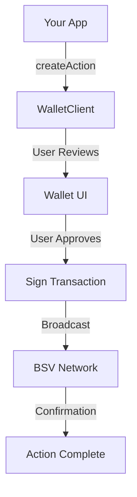

# Your First BSV Transaction with WalletClient

## Understanding the BSV Wallet Architecture

The BSV wallet system uses the WalletClient SDK to enable applications to interact with user wallets securely. Instead of directly sending to addresses, you create "actions" that the wallet executes on your behalf.

## 🚀 Quick Start: Create Your First Token

Let's start with something simple - creating a token that represents an event ticket and storing it in your wallet.

### Step 1: Connect to Your Wallet

```typescript
import { WalletClient, Script } from '@bsv/sdk'

// Connect to user's wallet
const wallet = new WalletClient()
```

### Step 2: Create Your First Token

```typescript
export async function createToken() {
    // Connect to user's wallet
    const wallet = new WalletClient()

    // Create a token which represents an event ticket
    const response = await wallet.createAction({
        description: 'create an event ticket',
        outputs: [{
            satoshis: 1,
            lockingScript: Script.fromASM('OP_NOP').toHex(),
            basket: 'event tickets',
            outputDescription: 'event ticket'
        }]
    })

    console.log('Token created!', response)
    return response
}
```

**What just happened?**
- You connected to your wallet
- Created an "action" that produces a new token
- The token is stored in your "event tickets" basket
- The wallet signed and broadcast the transaction

## 📦 Understanding Baskets

Baskets are like folders in your wallet that organize different types of tokens:

```typescript
export async function listTokens() {
    const wallet = new WalletClient()

    // List all tokens in your event tickets basket
    const response = await wallet.listOutputs({
        basket: 'event tickets'
    })

    console.log('Your tokens:', response)
    return response
}
```

## 🎟️ Redeem a Token

Now let's spend (redeem) one of your tokens:

```typescript
export async function redeemToken() {
    const wallet = new WalletClient()

    // First, list your available tokens
    const list = await wallet.listOutputs({
        basket: 'event tickets',
        include: 'entire transactions'
    })

    if (list.outputs.length === 0) {
        console.log('No tokens to redeem!')
        return
    }

    // Redeem the first token
    const response = await wallet.createAction({
        description: 'redeem an event ticket',
        inputBEEF: list.BEEF,
        inputs: [{
            outpoint: list.outputs[0].outpoint,
            unlockingScript: Script.fromASM('OP_TRUE').toHex(),
            inputDescription: 'event ticket'
        }]
    })

    console.log('Token redeemed!', response)
    return response
}
```

## 💬 Real-World Example: Hello World Message

Let's create a more interesting transaction - posting a message to a public overlay:

```typescript
import { 
    WalletClient, 
    PushDrop, 
    Utils, 
    SecurityLevels, 
    WalletProtocol, 
    TopicBroadcaster, 
    Transaction 
} from '@bsv/sdk'

export async function postHelloWorld() {
    // Connect to wallet
    const wallet = new WalletClient()
    const token = new PushDrop(wallet)

    // Create your message
    const message = 'Hello BSV World!'
    const fields = [Utils.toArray(message, 'utf8')]

    // Set up protocol parameters
    const protocolID: WalletProtocol = [SecurityLevels.Silent, 'hello world']
    const keyID = Date.now().toString()
    const counterparty = 'self'

    // Create the locking script
    const script = await token.lock(fields, protocolID, keyID, counterparty)

    // Create the token with your message
    const response = await wallet.createAction({
        description: 'Post Hello World Message',
        outputs: [{
            satoshis: 1,
            lockingScript: script.toHex(),
            basket: 'hello world',
            outputDescription: 'hello world message',
            customInstructions: keyID
        }]
    })

    // Broadcast to the hello world overlay
    const tx = Transaction.fromBEEF(response.tx)
    const overlay = new TopicBroadcaster(['tm_helloworld'])
    const overlayResponse = await tx.broadcast(overlay)

    console.log('Message posted!', overlayResponse)
    return overlayResponse
}
```

## 📡 Working with Overlays

Overlays are specialized services that index and serve specific types of BSV data:

### List Messages from an Overlay

```typescript
import { LookupResolver } from '@bsv/sdk'

export async function listHelloWorldMessages() {
    const overlay = new LookupResolver()

    const response = await overlay.query({
        service: 'ls_helloworld',
        query: {
            limit: 10,
            skip: 0,
            sortOrder: 'desc'
        }
    }, 10000)

    console.log('Recent messages:', response)
    return response
}
```

## 📄 Upload Files to BSV

You can also store files on BSV using distributed storage:

```typescript
import { WalletClient, StorageUploader, Utils } from '@bsv/sdk'

export async function uploadFile() {
    const wallet = new WalletClient()

    // Setup uploader
    const uploader = new StorageUploader({
        wallet,
        storageURL: 'https://nanostore.babbage.systems'
    })

    // Your file data
    const fileContent = 'This is my important document'
    const data = Utils.toArray(fileContent, 'utf8')

    // Upload the file
    const response = await uploader.publishFile({
        file: {
            data,
            type: 'text/plain'
        },
        retentionPeriod: 180 // minutes
    })

    console.log('File uploaded! URL:', response.publicURL)
    console.log('UHRP URL:', response.uhrpURL)
    return response
}
```

### Download Files

```typescript
import { StorageDownloader, Utils } from '@bsv/sdk'

export async function downloadFile(uhrpURL: string) {
    const downloader = new StorageDownloader()
    
    // Download using UHRP URL
    const response = await downloader.download(uhrpURL)
    const text = Utils.toUTF8(response.data)

    console.log('File content:', text)
    return text
}
```

## 🔐 Understanding Transaction Security

### How WalletClient Protects You

1. **Permission-Based**: Apps request specific actions
2. **User Approval**: You approve each transaction
3. **Key Isolation**: Apps never see your private keys
4. **Action Descriptions**: Clear explanations of what will happen

### Transaction Flow


```mermaid
graph TD
    A[Your App] -->|createAction| B[WalletClient]
    B -->|User Reviews| C[Wallet UI]
    C -->|User Approves| D[Sign Transaction]
    D -->|Broadcast| E[BSV Network]
    E -->|Confirmation| F[Action Complete]
```

## 🎯 Common Patterns

### 1. Simple Payment Transaction

```typescript
export async function makePayment(amount: number, description: string) {
    const wallet = new WalletClient()
    
    const response = await wallet.createAction({
        description: `Payment: ${description}`,
        outputs: [{
            satoshis: amount,
            lockingScript: Script.fromASM('OP_DUP OP_HASH160 <pubkeyhash> OP_EQUALVERIFY OP_CHECKSIG').toHex(),
            outputDescription: description
        }]
    })
    
    return response
}
```

### 2. Data Storage Transaction

```typescript
export async function storeData(dataString: string) {
    const wallet = new WalletClient()
    const data = Utils.toArray(dataString, 'utf8')
    
    const response = await wallet.createAction({
        description: 'Store data on-chain',
        outputs: [{
            satoshis: 0,
            lockingScript: Script.fromASM(`OP_FALSE OP_RETURN ${data}`).toHex(),
            outputDescription: 'Data storage'
        }]
    })
    
    return response
}
```

### 3. Token Transfer

```typescript
export async function transferToken(tokenOutpoint: string, recipientScript: string) {
    const wallet = new WalletClient()
    
    // Get the token details
    const list = await wallet.listOutputs({
        basket: 'my-tokens',
        include: 'entire transactions'
    })
    
    const token = list.outputs.find(o => o.outpoint === tokenOutpoint)
    if (!token) throw new Error('Token not found')
    
    // Transfer the token
    const response = await wallet.createAction({
        description: 'Transfer token',
        inputBEEF: list.BEEF,
        inputs: [{
            outpoint: token.outpoint,
            unlockingScript: Script.fromASM('OP_TRUE').toHex(),
            inputDescription: 'Token to transfer'
        }],
        outputs: [{
            satoshis: token.satoshis,
            lockingScript: recipientScript,
            outputDescription: 'Token transfer'
        }]
    })
    
    return response
}
```

## 📊 Transaction Fees

BSV transaction fees are extremely low:

```typescript
// Typical fee calculation
const typicalFeeRate = 1 // satoshi per byte
const typicalTxSize = 250 // bytes
const totalFee = typicalFeeRate * typicalTxSize // 250 satoshis
const feeInUSD = (totalFee / 100000000) * bsvPrice // ~$0.0001
```

## 🔧 Troubleshooting

### Common Issues

**"Wallet not connected"**
- Ensure wallet extension/app is installed
- Check if user has approved connection

**"Insufficient funds"**
- Check wallet balance
- Account for transaction fees

**"Action rejected"**
- User declined the transaction
- Review action description clarity

## 📚 Next Steps

Now that you've created your first transactions:

1. **[Explore SDK Documentation](https://docs.bsvblockchain.org)** - Deep dive into capabilities
2. **[Build Applications](../03-learning-pathways/technical/README.md)** - Create your own BSV apps
3. **[Learn About Overlays](../04-specialized-topics/README.md)** - Specialized services
4. **[Join the Community](https://discord.gg/bsv)** - Get help and share ideas

## 🔗 Resources

### SDK References
- [@bsv/sdk Documentation](https://github.com/bitcoin-sv/ts-sdk)
- [WalletClient API](https://docs.bsvblockchain.org/walletclient)
- [Overlay Services](https://docs.bsvblockchain.org/overlays)

### Example Applications
- [BSV App Examples](https://github.com/bitcoin-sv/examples)
- [Token Protocols](https://github.com/bitcoin-sv/tokens)
- [Storage Examples](https://github.com/bitcoin-sv/storage)

---

**Congratulations!** You've learned how to create BSV transactions using the WalletClient SDK. This modern approach gives you powerful capabilities while keeping your keys secure. Keep exploring and building!