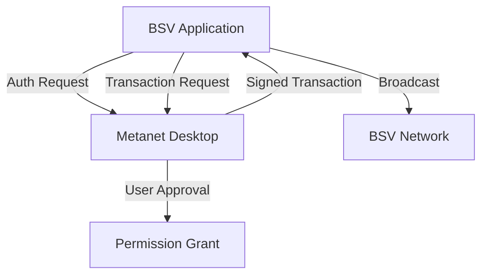

# Your First BSV Transaction with Metanet Desktop

## Understanding Metanet Desktop Architecture

Metanet Desktop is not a traditional wallet that allows direct sending and receiving to addresses. Instead, it's a sophisticated application platform that enables BSV applications to authenticate and request transaction signing.

## 🏗️ How Metanet Desktop Works

### Core Functionality

Metanet Desktop serves as:
- **Identity Provider**: Manages your BSV identity and keys
- **Signing Service**: Signs transactions for authorized applications
- **Authentication Layer**: Provides secure login to BSV applications
- **Permission Manager**: Controls what applications can do with your identity

### Architecture Overview


```mermaid
graph TD
    A[BSV Application] -->|Auth Request| B[Metanet Desktop]
    B -->|User Approval| C[Permission Grant]
    A -->|Transaction Request| B
    B -->|Signed Transaction| A
    A -->|Broadcast| D[BSV Network]
```

## 🚀 Making Your First Transaction

### Step 1: Install a Compatible Application

Metanet Desktop works with applications built for the Metanet ecosystem. Popular options include:

1. **Twetch** - Social media platform
2. **RelayX** - Super app with wallet features
3. **MetaStreme** - Media streaming platform
4. **Custom BSV Apps** - Any app using Metanet protocols

### Step 2: Connect Application to Metanet Desktop

1. Open the BSV application
2. Click "Connect with Metanet" or similar
3. Metanet Desktop will prompt for permission
4. Review requested permissions:
   - Read identity
   - Sign transactions
   - Access specific data
5. Approve the connection

### Step 3: Application-Initiated Transactions

Once connected, the application can:

```javascript
// Example: Application requests transaction signing
const transaction = {
    outputs: [{
        to: 'recipient-address',
        amount: 100000, // satoshis
        data: ['Hello', 'BSV']
    }]
};

// Request signing from Metanet Desktop
const signedTx = await metanet.signTransaction(transaction);

// Application broadcasts the signed transaction
const txid = await broadcast(signedTx);
```

## 📱 Real-World Transaction Flow

### Example: Social Media Post on Twetch

1. **Compose Post** in Twetch application
2. **Twetch Creates Transaction**:
   - Post data
   - Required fees
   - Platform fees
3. **Metanet Desktop Prompts**:
   - "Twetch wants to sign a transaction"
   - Shows transaction details
   - Displays total cost
4. **User Approves** in Metanet Desktop
5. **Transaction Signed** and returned to Twetch
6. **Twetch Broadcasts** to BSV network
7. **Post Appears** on the platform

## 💡 Understanding Metanet Transactions

### Transaction Types via Applications

1. **Data Storage**
   - Social media posts
   - File uploads
   - Application data

2. **Token Operations**
   - Token transfers
   - NFT minting
   - Smart contract interactions

3. **Identity Operations**
   - Profile updates
   - Attestations
   - Verifications

4. **Application-Specific**
   - In-app purchases
   - Service payments
   - Subscription fees

## 🔐 Security Model

### Permission-Based Access

Applications must request specific permissions:

```
✅ Read public profile
✅ Sign transactions up to 0.01 BSV
❌ Access private messages
❌ Sign unlimited transactions
```

### Transaction Approval

Every transaction requires explicit approval:
- See exactly what you're signing
- Review costs before approving
- Revoke permissions anytime

## 🛠️ Developer Perspective

### Building Apps for Metanet Desktop

```javascript
// Initialize Metanet connection
const metanet = new MetanetSDK({
    app: 'MyApp',
    permissions: ['identity', 'transactions']
});

// Request authentication
const identity = await metanet.authenticate();

// Create and sign transaction
const tx = await metanet.createTransaction({
    data: {
        type: 'post',
        content: 'Hello from MyApp!'
    },
    outputs: [{
        amount: calculateFee(),
        to: 'app-address'
    }]
});

// Broadcast transaction
const result = await metanet.broadcast(tx);
```

## 🎯 Common Use Cases

### 1. Social Media Interactions
- Post content
- Like/comment
- Follow users
- Send tips

### 2. Content Creation
- Upload files
- Mint NFTs
- Create tokens
- Publish articles

### 3. Gaming
- In-game purchases
- Save game states
- Trade items
- Tournament entries

### 4. Business Applications
- Sign documents
- Create invoices
- Process payments
- Manage permissions

## 📊 Transaction Management

### Viewing Transaction History

1. **In Metanet Desktop**:
   - See approved transactions
   - Review permissions granted
   - Monitor application activity

2. **In Applications**:
   - Application-specific history
   - Detailed transaction records
   - Export capabilities

3. **On Block Explorers**:
   - [WhatsOnChain](https://whatsonchain.com)
   - Full transaction details
   - On-chain verification

## 🔧 Troubleshooting

### Common Issues

**Application Can't Connect**
- Ensure Metanet Desktop is running
- Check firewall settings
- Verify application compatibility

**Transaction Rejected**
- Insufficient balance
- Permission not granted
- Application error

**Signing Failed**
- Check Metanet Desktop logs
- Verify identity is unlocked
- Review transaction details

## 📚 Next Steps

Now that you understand Metanet Desktop:

1. **[Explore Compatible Apps](examples.md)** - Find applications to use
2. **[Developer Guide](../03-learning-pathways/technical/README.md)** - Build your own apps
3. **[Security Best Practices](../02-foundations/core-concepts.md)** - Stay safe
4. **[Advanced Features](../04-specialized-topics/README.md)** - Power user guide

## 🔗 Resources

### For Users
- [Metanet Desktop Documentation](https://docs.metanet.desktop)
- [Compatible Applications List](https://metanet.apps)
- [Community Support](https://discord.gg/metanet)

### For Developers
- [Metanet SDK](https://github.com/metanet/sdk)
- [Integration Guide](https://docs.metanet.dev)
- [Example Applications](https://github.com/metanet/examples)

---

**Remember**: Metanet Desktop empowers you to interact with BSV applications securely while maintaining control of your keys and identity. It's not about sending to addresses directly - it's about enabling rich application experiences on BSV!