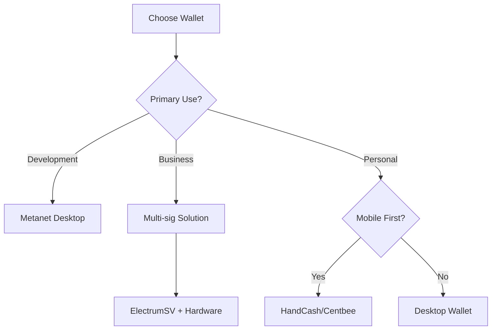

# BSV Wallet Setup Guide

## Your Gateway to the BSV Ecosystem

Setting up a BSV wallet is your first step into the ecosystem. This guide covers all wallet options and helps you choose the right one for your needs.

## 🎯 Quick Setup (5 minutes)

### Recommended: Metanet Desktop Wallet

The Metanet Desktop wallet is the most feature-rich option for developers and power users.

1. **Download the wallet**
   - Visit [Metanet Desktop](metanet-desktop.md)
   - Choose your operating system
   - Download and install

2. **Create your identity**
   - Launch the wallet
   - Click "Create New Identity"
   - Secure your recovery phrase (CRITICAL!)
   - Set up your PIN/password

3. **Fund your wallet**
   - Copy your receive address
   - Purchase BSV from an exchange
   - Send a small amount to test

**That's it!** You're ready to use BSV.

## 📱 Wallet Options Overview

### Desktop Wallets

| Wallet | Best For | Key Features |
|--------|----------|--------------|
| **Metanet Desktop** | Developers, Power Users | Identity management, Dev tools, Full node option |
| **ElectrumSV** | Advanced Users | SPV, Hardware wallet support, Multi-sig |
| **Bitcoin SV Node** | Node Operators | Full blockchain, Mining capability |

### Mobile Wallets

| Wallet | Platform | Best For |
|--------|----------|----------|
| **HandCash** | iOS/Android | Consumer payments, Social features |
| **Centbee** | iOS/Android | Remittances, Easy onboarding |
| **Simply Cash** | iOS/Android | Basic transactions |

### Web Wallets

| Wallet | Use Case | Integration |
|--------|----------|-------------|
| **MoneyButton** | Web payments | JavaScript SDK |
| **Tokenized Wallet** | Token management | API access |
| **Web3 Wallets** | dApp interaction | Browser extension |

### Developer Wallets

| Solution | Purpose | Documentation |
|----------|---------|---------------|
| **SDK Wallets** | App integration | Language-specific |
| **SPV Wallet Server** | Infrastructure | Self-hosted |
| **Test Wallets** | Development | Testnet only |

## 🔐 Security Best Practices

### Essential Security Steps

1. **Backup Your Keys**
   ```
   ⚠️ CRITICAL: Write down your recovery phrase
   - Use pen and paper (not digital)
   - Store in secure location
   - Never share with anyone
   - Test recovery before funding
   ```

2. **Secure Your Device**
   - Use strong device passwords
   - Enable 2FA where available
   - Keep software updated
   - Use antivirus protection

3. **Safe Usage**
   - Verify addresses before sending
   - Start with small amounts
   - Use separate wallets for different purposes
   - Regular backups

## 🚀 Setting Up for Different Use Cases

### For Developers

1. **Install Metanet Desktop**
2. **Enable developer mode**
3. **Connect to testnet**
4. **Install SDK for your language**

```bash
# TypeScript/JavaScript
npm install @bsv/sdk

# Python
pip install bsv-sdk

# Go
go get github.com/libsv/go-sdk
```

### For Businesses

1. **Set up corporate wallet**
   - Multi-signature setup
   - Role-based access
   - Audit trail configuration

2. **Integration options**
   - API connectivity
   - Payment processing
   - Accounting integration

### For Personal Use

1. **Mobile wallet** for daily use
2. **Desktop wallet** for savings
3. **Hardware wallet** for large amounts

## 💰 Funding Your Wallet

### Getting BSV

1. **Cryptocurrency Exchanges**
   - Register and verify account
   - Purchase BSV with fiat
   - Withdraw to your wallet

2. **Peer-to-Peer**
   - LocalBitcoins alternatives
   - BSV community trades
   - OTC desks for large amounts

3. **Earning BSV**
   - Development bounties
   - Content creation
   - Service provision

### Testnet BSV (for developers)

```bash
# Get free testnet coins
curl https://testnet.faucet.bitcoin.com/bsv
```

## 🔧 Wallet Features Explained

### Basic Features
- **Send/Receive**: Core transaction functionality
- **Address Book**: Save frequent recipients
- **Transaction History**: Complete record
- **QR Codes**: Easy mobile scanning

### Advanced Features
- **Multi-sig**: Shared control
- **Payment Channels**: High-frequency transactions
- **Token Support**: Digital assets
- **Identity Management**: Certificates and attestations

### Developer Features
- **Script Debugging**: Transaction analysis
- **Custom Scripts**: Advanced transactions
- **API Access**: Programmatic control
- **Testnet Mode**: Safe development

## 📊 Choosing the Right Wallet

### Decision Matrix



### Comparison Checklist

Consider these factors:
- [ ] Platform compatibility
- [ ] Security requirements
- [ ] Feature needs
- [ ] Integration requirements
- [ ] User experience preferences
- [ ] Backup and recovery options

## 🆘 Troubleshooting

### Common Issues

1. **Can't receive funds**
   - Check address format
   - Ensure wallet is synced
   - Verify network (mainnet vs testnet)

2. **Transaction stuck**
   - Check fee amount
   - Wait for confirmation
   - Contact support if needed

3. **Lost access**
   - Use recovery phrase
   - Contact wallet support
   - Check backup locations

## 📚 Next Steps

After setting up your wallet:

1. **[Make your first transaction](first-transaction.md)** - Send and receive BSV
2. **[Explore examples](examples.md)** - See what's possible
3. **[Choose learning path](choose-your-path.md)** - Deep dive into BSV
4. **[Join community](../06-resources/community.md)** - Get support

## 🔗 Wallet Resources

### Official Sites
- [Metanet Desktop](https://metanet.id)
- [HandCash](https://handcash.io)
- [ElectrumSV](https://electrumsv.io)
- [Centbee](https://centbee.com)

### Support Channels
- Wallet-specific Discord channels
- GitHub issues for open-source wallets
- Community forums
- Video tutorials

---

**Remember**: Your private keys are your responsibility. No legitimate service will ever ask for them. Stay safe and enjoy the BSV ecosystem!