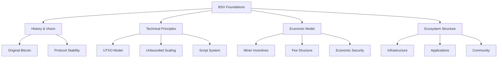

# BSV Foundations

## Essential Knowledge for Everyone

Before diving into specialized pathways, understanding these foundational concepts will accelerate your BSV journey. This section covers the core principles, history, and unique aspects of BSV that apply regardless of your role or goals.

## 📚 What You'll Learn

### Core Topics

1. **[BSV Evolution and Paradigm](bsv-evolution.md)**
   - The history from Bitcoin to BSV
   - Why the original protocol matters
   - The paradigm shift in thinking

2. **[Core Concepts](core-concepts.md)**
   - UTXO model explained
   - Transactions and scripts
   - Proof of Work consensus
   - SPV and scaling

3. **[Why BSV](why-bsv.md)**
   - Technical advantages
   - Economic incentives
   - Regulatory compliance
   - Competitive analysis

4. **[Ecosystem Overview](ecosystem-overview.md)**
   - Key players and roles
   - Infrastructure components
   - Development landscape
   - Business applications

## 🎯 Learning Objectives

After completing this section, you will:

- ✅ Understand BSV's origin and vision
- ✅ Grasp fundamental blockchain concepts
- ✅ Know why BSV differs from other blockchains
- ✅ Navigate the BSV ecosystem confidently
- ✅ Make informed decisions about using BSV

## 🗺️ Conceptual Framework

## 💡 Key Principles to Remember

### 1. **Peer-to-Peer Electronic Cash**
BSV maintains Bitcoin's original vision as described in the whitepaper - a peer-to-peer electronic cash system that scales globally.

### 2. **Stable Protocol**
Unlike other blockchains, BSV's protocol is locked, providing a stable foundation for long-term development.

### 3. **Unbounded Scaling**
No artificial limits on block size or transaction throughput - the system scales with demand.

### 4. **Economic Incentives**
Miners are incentivized by transaction fees, not block subsidies, ensuring long-term sustainability.

### 5. **Legal Compliance**
Designed to work within existing legal frameworks, not to circumvent them.

## 📊 Foundation Concepts Overview

### Technical Foundations

| Concept | Description | Why It Matters |
|---------|-------------|----------------|
| **UTXO** | Unspent Transaction Output model | Enables parallel processing and scaling |
| **Script** | Transaction programming language | Allows complex smart contracts |
| **SPV** | Simplified Payment Verification | Enables light clients and mobile usage |
| **Merkle Trees** | Data structure for verification | Efficient proof of inclusion |
| **Proof of Work** | Consensus mechanism | Ensures network security |

### Economic Foundations

| Principle | Implementation | Benefit |
|-----------|----------------|---------|
| **Fixed Supply** | 21 million coin cap | Predictable monetary policy |
| **Fee Market** | Competitive transaction fees | Sustainable miner revenue |
| **Instant Transactions** | 0-conf for small amounts | Practical for commerce |
| **Micropayments** | Sub-cent transactions | New business models |

### Legal Foundations

| Aspect | Approach | Result |
|--------|----------|--------|
| **Transparency** | Public ledger | Audit trail |
| **Identity** | Not anonymous | Compliance ready |
| **Property Rights** | Legal framework compatible | Enterprise adoption |
| **Regulations** | Works within existing law | Reduced risk |

## 🔄 How These Concepts Connect

Understanding the foundations helps you see how:

- **Technical features** enable **economic benefits**
- **Economic incentives** ensure **network security**
- **Legal compliance** drives **enterprise adoption**
- **Stable protocol** allows **long-term planning**

## 📈 Progressive Learning Path

### Start Here (30 minutes)
1. Read [BSV Evolution](bsv-evolution.md) - Understand the history
2. Review [Core Concepts](core-concepts.md) - Grasp the basics
3. Explore [Why BSV](why-bsv.md) - See the advantages

### Go Deeper (2 hours)
1. Study [Ecosystem Overview](ecosystem-overview.md)
2. Review technical details in each concept
3. Compare with other blockchain approaches

### Apply Knowledge
1. Relate concepts to your use case
2. Identify relevant features for your needs
3. Choose appropriate pathway for specialization

## 🎓 Self-Assessment Questions

Test your understanding:

1. **What makes BSV different from BTC?**
   - Protocol stability
   - No block size limit
   - Original Bitcoin vision

2. **What is the UTXO model?**
   - Unspent Transaction Output
   - Enables parallel processing
   - Core to Bitcoin's design

3. **Why does scaling matter?**
   - Global adoption requires it
   - Keeps fees low
   - Enables new use cases

4. **How does BSV ensure security?**
   - Proof of Work consensus
   - Economic incentives
   - Distributed network

## 🚀 Applying Foundation Knowledge

### For Developers
- Understand UTXO for efficient coding
- Grasp Script for smart contracts
- Use SPV for light clients

### For Business Leaders
- See economic advantages
- Understand compliance benefits
- Recognize scaling potential

### For Architects
- Design with UTXO model
- Plan for unlimited scale
- Ensure legal compliance

### For Researchers
- Study consensus mechanisms
- Analyze economic models
- Explore scaling solutions

## 📚 Additional Resources

### Essential Reading
- [Bitcoin Whitepaper](https://bitcoinsv.io/bitcoin.pdf)
- [BSV Technical Standards](https://tsc.bitcoinassociation.net/)
- [Economic Security Model](https://bitcoinsv.io/economic-security)

### Videos & Tutorials
- BSV Academy foundations course
- Technical deep dives
- Economic model explanations

### Community Resources
- [BSV Wiki](https://wiki.bitcoinsv.io)
- [Developer Forums](https://bitcointalk.org)
- [Discord Channels](https://discord.gg/bsv)

## ✅ Checklist Before Moving On

Before proceeding to specialized pathways, ensure you understand:

- [ ] The difference between BSV and other blockchains
- [ ] Basic UTXO model concepts
- [ ] Why unlimited scaling is possible
- [ ] How miners are incentivized
- [ ] The importance of protocol stability
- [ ] BSV's approach to legal compliance

## 🎯 Next Steps

With these foundations in place, you're ready to:

1. **[Choose Your Pathway](../01-getting-started/choose-your-path.md)** - Specialize based on your role
2. **[Explore Examples](../01-getting-started/examples.md)** - See practical applications
3. **[Join Community](../06-resources/community.md)** - Connect with others

---

**Remember**: These foundations are the bedrock of your BSV knowledge. Refer back to them whenever you need to reinforce core concepts or explain BSV to others.