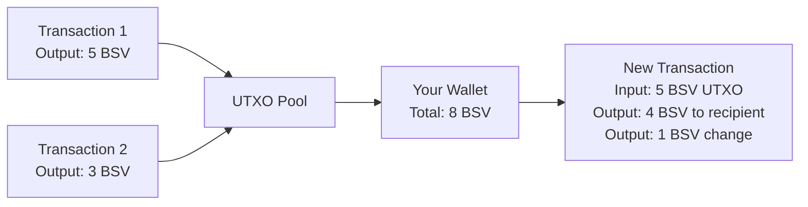
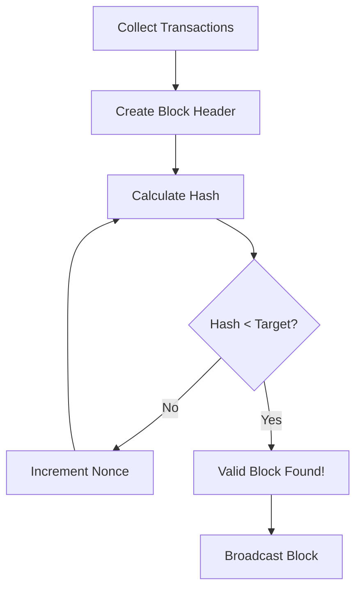
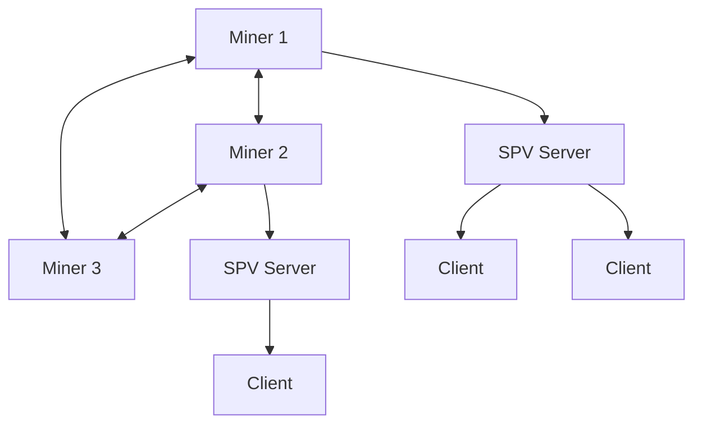

# BSV Core Concepts

## The Essential Building Blocks

Understanding these core concepts is crucial for working with BSV effectively. This page explains the fundamental components that make BSV unique and powerful.

## 🏗️ The UTXO Model

### What is UTXO?

UTXO stands for **Unspent Transaction Output**. Unlike account-based systems, BSV tracks individual coins rather than balances.



### Why UTXO Matters

1. **Parallel Processing**: Each UTXO is independent
2. **Privacy**: New addresses for each transaction
3. **Simplicity**: Clear ownership model
4. **Scalability**: No global state to manage

### UTXO in Practice

```javascript
// Conceptual representation
const utxo = {
  txid: "abc123...",        // Transaction that created it
  outputIndex: 0,            // Which output in that transaction
  script: "OP_DUP OP_HASH160...", // Locking script
  satoshis: 50000            // Amount in satoshis
};

// Spending a UTXO
const newTx = {
  inputs: [utxo],            // Consume the UTXO
  outputs: [
    { to: "address1", amount: 30000 },  // Payment
    { to: "myAddress", amount: 19800 }  // Change (minus fee)
  ]
};
```

## 📝 Transactions and Scripts

### Transaction Structure

Every BSV transaction consists of:

1. **Version**: Protocol version
2. **Inputs**: UTXOs being spent
3. **Outputs**: New UTXOs being created
4. **Locktime**: Time-based constraints

```
┌─────────────────────────────────────┐
│           Transaction               │
├─────────────────────────────────────┤
│ Version: 2                          │
├─────────────────────────────────────┤
│ Inputs:                             │
│   - Previous TX: abc123...          │
│   - Output Index: 0                 │
│   - Unlocking Script: <sig> <pubkey>│
├─────────────────────────────────────┤
│ Outputs:                            │
│   - Amount: 50000 satoshis          │
│   - Locking Script: OP_DUP...       │
├─────────────────────────────────────┤
│ Locktime: 0                         │
└─────────────────────────────────────┘
```

### Bitcoin Script

BSV's scripting language enables programmable money:

- **Stack-based**: Operations work on a stack
- **Turing-complete**: Can compute anything (with fees)
- **Deterministic**: Same input = same output
- **Secure**: No loops without payment

Common script patterns:
```
# Pay to Public Key Hash (P2PKH)
OP_DUP OP_HASH160 <pubKeyHash> OP_EQUALVERIFY OP_CHECKSIG

# Data storage
OP_FALSE OP_RETURN <data>

# Multi-signature
OP_2 <pubKey1> <pubKey2> <pubKey3> OP_3 OP_CHECKMULTISIG
```

## ⛏️ Proof of Work Consensus

### How PoW Works

1. **Miners collect transactions** into a block
2. **Find a nonce** that produces a valid hash
3. **Broadcast the block** to the network
4. **Other nodes verify** and accept the block



### Security Through Work

- **Computational cost**: Attacking requires massive resources
- **Economic incentive**: More profitable to mine honestly
- **Probabilistic finality**: Deeper blocks = more secure

## 🔍 SPV (Simplified Payment Verification)

### What is SPV?

SPV allows lightweight clients to verify transactions without downloading the entire blockchain.

### How SPV Works

1. **Download block headers** only (80 bytes per block)
2. **Request Merkle proof** for specific transactions
3. **Verify inclusion** in the blockchain
4. **Confirm work** done on top

```
Full Node: 500GB+ blockchain
SPV Client: ~50MB headers only
```

### SPV Benefits

- **Mobile friendly**: Minimal storage required
- **Fast sync**: Minutes instead of days
- **Privacy**: Only request relevant transactions
- **Scalable**: Millions of SPV clients possible

## 💰 Fee Structure

### Economic Design

BSV fees are designed to be:
- **Predictable**: Based on transaction size
- **Minimal**: Fractions of a cent
- **Sustainable**: Support miner revenue
- **Market-based**: Competition keeps fees low

### Fee Calculation

```javascript
// Simple fee calculation
const txSizeBytes = 250;
const feeRate = 1; // satoshis per byte
const totalFee = txSizeBytes * feeRate;
// Result: 250 satoshis (~$0.0001)
```

### Fee Types

| Type | Use Case | Typical Rate |
|------|----------|--------------|
| **Standard** | Regular payments | 1 sat/byte |
| **Data** | Large data storage | 0.5 sat/byte |
| **Consolidation** | Combining UTXOs | 0.5 sat/byte |
| **Priority** | Faster confirmation | 2-5 sat/byte |

## 🔗 Merkle Trees

### Purpose

Merkle trees enable efficient and secure verification of large data sets.

```
                    Root Hash
                   /         \
            Hash 0-1           Hash 2-3
           /       \          /       \
      Hash 0     Hash 1   Hash 2    Hash 3
        |          |        |         |
      TX 0       TX 1     TX 2      TX 3
```

### Benefits

- **Efficient proofs**: Log(n) proof size
- **Tamper evident**: Any change affects root
- **Partial verification**: Verify specific transactions
- **Scalable**: Works with billions of transactions

## ⚡ Instant Transactions

### 0-Confirmation Transactions

BSV enables instant transactions for practical commerce:

1. **Broadcast transaction** to network
2. **Merchants see it** immediately
3. **Accept for small amounts** without waiting
4. **Confirmation follows** in next block

### Double-Spend Protection

- **First-seen rule**: Nodes reject conflicting transactions
- **Merchant tools**: Monitor for double-spends
- **Risk assessment**: Based on amount and customer
- **Economic security**: Cost to attack > benefit

## 🌐 Network Architecture

### Node Types

1. **Mining Nodes**
   - Validate transactions
   - Create new blocks
   - Maintain full blockchain

2. **Merchant Nodes**
   - Validate transactions
   - Serve SPV clients
   - May prune old data

3. **SPV Clients**
   - Lightweight verification
   - Mobile and desktop wallets
   - Trust mining nodes

### Network Topology



## 📊 Scaling Approach

### Horizontal Scaling

- **No block size limit**: Blocks grow with demand
- **Parallel validation**: Multiple cores process transactions
- **Efficient propagation**: Graphene, compact blocks
- **Hardware advances**: Leverage improving technology

### Demonstrated Scale

| Metric | Achieved | Potential |
|--------|----------|-----------|
| **Block Size** | 4GB | Unlimited |
| **Transactions/Second** | 50,000+ | Millions |
| **Transaction Cost** | <$0.001 | <$0.0001 |
| **Confirmation Time** | ~10 min | Instant (0-conf) |

## 🎯 Key Takeaways

### Remember These Points

1. **UTXO model** enables parallel processing
2. **Script system** allows programmable money
3. **PoW consensus** ensures security
4. **SPV** enables lightweight clients
5. **Low fees** make micropayments viable
6. **Instant transactions** support commerce
7. **Unlimited scaling** meets global demand

### Common Misconceptions

❌ "Blockchain can't scale" → ✅ BSV proves otherwise
❌ "Need complex Layer 2" → ✅ Layer 1 handles everything
❌ "High fees are necessary" → ✅ Competition keeps fees minimal
❌ "Must run full node" → ✅ SPV is secure and practical

## 📚 Deep Dive Resources

### Technical Documentation
- [Protocol Specification](https://github.com/bitcoin-sv-specs/protocol)
- [Script Reference](https://wiki.bitcoinsv.io/index.php/Script)
- [SPV Implementation](https://docs.bitcoinsv.io/bitcoin-sv/spv)

### Practical Guides
- [UTXO Management](../03-learning-pathways/technical/03-building-apps/)
- [Script Examples](../01-getting-started/examples.md)
- [Fee Optimization](../03-learning-pathways/business/implementation-guide.md)

## ✅ Understanding Check

You should now understand:
- [ ] How UTXOs differ from accounts
- [ ] Basic transaction structure
- [ ] What makes Script powerful
- [ ] How consensus works
- [ ] Why SPV is important
- [ ] How BSV scales

Ready to see why these concepts matter? Continue to [Why BSV](why-bsv.md) →