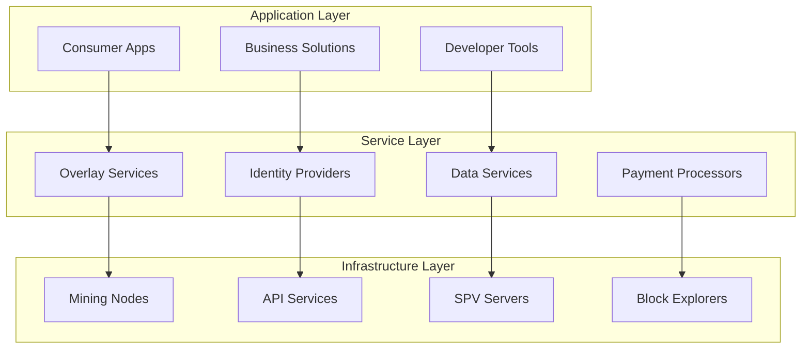
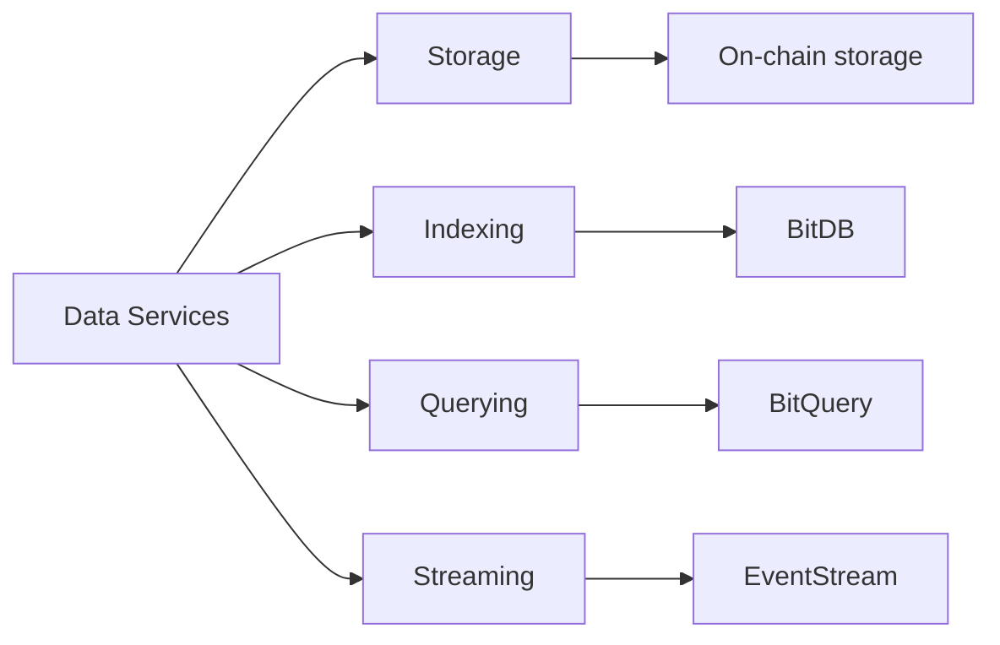
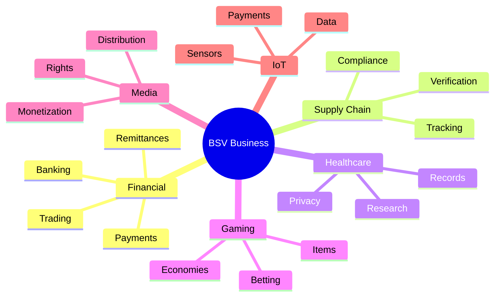

# BSV Ecosystem Overview

## The Complete Landscape of BSV Infrastructure and Applications

The BSV ecosystem is a thriving network of infrastructure providers, developers, businesses, and users building the future of data and payments. This overview maps the entire ecosystem to help you understand how components work together.

## 🌐 Ecosystem Architecture

### Three-Layer Model



## 🏗️ Infrastructure Components

### Mining Infrastructure

| Component | Provider | Purpose |
|-----------|----------|---------|
| **TAAL** | Enterprise Mining | Large-scale transaction processing |
| **GorillaPool** | Open Mining | Community-driven mining |
| **SVPool** | Regional Mining | Geographic distribution |
| **Mining APIs** | mAPI Standard | Direct miner communication |

### Node Software

1. **SV Node**
   - Current production implementation
   - Full validation and mining capability
   - Enterprise-grade performance

2. **Teranode** (Coming)
   - Next-generation architecture
   - Microservices design
   - Million+ TPS capability

### API Infrastructure

```javascript
// Key API Services
const infrastructure = {
  "WhatsOnChain": "Block explorer and APIs",
  "mAPI": "Merchant API for miners",
  "Taal API": "Enterprise transaction services",
  "Bitbus": "Real-time transaction streaming",
  "Planaria": "Bitcoin computing system"
};
```

## 💼 Service Providers

### Wallet Providers

| Wallet | Type | Target User | Key Features |
|--------|------|-------------|--------------|
| **Metanet** | Desktop | Developers | Identity, dev tools |
| **HandCash** | Mobile | Consumers | Social, gaming |
| **Centbee** | Mobile | Remittance | Multi-currency |
| **ElectrumSV** | Desktop | Power Users | SPV, multisig |
| **MoneyButton** | Web | Websites | One-click payments |

### Identity Services

1. **MetaID Protocol**
   - Decentralized identity
   - Cross-application data
   - User-controlled privacy

2. **Paymail**
   - Human-readable addresses
   - Service discovery
   - Identity attestation

### Data Services



## 🛠️ Developer Ecosystem

### SDKs and Libraries

| Language | Library | Maintainer | Use Case |
|----------|---------|------------|----------|
| **JavaScript** | @bsv/sdk | BSV Association | Web apps |
| **Python** | py-bsv | Community | Data science |
| **Go** | go-sdk | libsv | Services |
| **Java** | bitcoinj-sv | nChain | Enterprise |
| **C++** | libsv | Various | Performance |

### Development Tools

1. **sCrypt**
   - High-level smart contract language
   - IDE integration
   - Testing framework
   - Debugging tools

2. **Script Debugger**
   - Transaction analysis
   - Step-through execution
   - Stack visualization

3. **Transaction Builders**
   - Visual construction
   - Template library
   - Fee estimation

### Documentation Resources

- **BSV Wiki**: Technical reference
- **BSV Academy**: Educational content
- **Developer Docs**: API documentation
- **GitHub Repos**: Code examples

## 🏢 Business Applications

### Industry Solutions



### Notable Projects

| Project | Category | Description |
|---------|----------|-------------|
| **Tokenized** | Securities | Digital asset platform |
| **UNISOT** | Supply Chain | Sea-to-plate tracking |
| **EHR Data** | Healthcare | Medical records |
| **Transmira** | AR/Gaming | Augmented reality |
| **Twetch** | Social Media | Decentralized Twitter |
| **TonicPow** | Advertising | P2P promotion |

## 🔗 Standards and Protocols

### Transaction Standards (BRCs)

1. **BRC-1**: Transaction Specification
2. **BRC-2**: Envelope Specification  
3. **BRC-3**: Merkle Proof Standard
4. **BRC-62**: BEEF Format
5. **BRC-74**: BUMP Format

### Application Protocols

```javascript
// Common protocols
const protocols = {
  "Paymail": "Human-readable addresses",
  "MetaNet": "On-chain data structure",
  "MAP": "Magic Attribute Protocol",
  "B://": "Bitcoin data protocol",
  "AIP": "Author Identity Protocol"
};
```

### Overlay Services

Specialized services for specific use cases:
- Token management
- Data synchronization
- Identity verification
- Payment channels
- State management

## 👥 Community and Governance

### Key Organizations

1. **BSV Association**
   - Protocol stewardship
   - Technical standards
   - Ecosystem development

2. **Bitcoin Association**
   - Business development
   - Education initiatives
   - Global advocacy

3. **Technical Standards Committee**
   - Protocol specifications
   - Standard development
   - Community input

### Community Channels

- **Discord**: Real-time chat
- **Forums**: Long-form discussion
- **GitHub**: Code collaboration
- **Twitter/X**: News and updates
- **Conferences**: In-person events

## 📊 Ecosystem Metrics

### Network Statistics

```
Current Status (Live):
├── Daily Transactions: 300,000+
├── Average Block Size: Growing
├── Total Data Stored: Terabytes
├── Active Applications: 100+
├── Developer Count: 1000+
└── Geographic Reach: Global
```

### Growth Indicators

1. **Transaction Volume**: Steady growth
2. **Data Usage**: Exponential increase
3. **Developer Activity**: Rising commits
4. **Business Adoption**: New use cases
5. **Geographic Expansion**: Global reach

## 🚀 Future Developments

### Roadmap Highlights

1. **Teranode Release**
   - Microservices architecture
   - Horizontal scaling
   - Enterprise features

2. **IPv6 Integration**
   - Direct peer connections
   - Enhanced privacy
   - Better routing

3. **Enhanced SPV**
   - Lighter clients
   - Faster verification
   - Mobile optimization

4. **Enterprise Tools**
   - Compliance features
   - Management dashboards
   - Integration frameworks

## 🎯 Getting Involved

### For Developers
1. Join developer Discord
2. Contribute to open source
3. Build applications
4. Share knowledge

### For Businesses
1. Explore use cases
2. Connect with providers
3. Pilot projects
4. Scale solutions

### For Investors
1. Research projects
2. Understand technology
3. Evaluate teams
4. Long-term vision

## 📚 Ecosystem Resources

### Essential Links

- **[BSV Association](https://bitcoinsv.io)** - Protocol information
- **[Bitcoin Association](https://bitcoinassociation.net)** - Business resources
- **[WhatsOnChain](https://whatsonchain.com)** - Block explorer
- **[BSV Wiki](https://wiki.bitcoinsv.io)** - Technical documentation

### Development Resources

- **[GitHub BSV](https://github.com/bitcoin-sv)** - Core repositories
- **[sCrypt](https://scrypt.io)** - Smart contracts
- **[BSV Academy](https://bitcoinsv.academy)** - Education
- **[DevDocs](https://docs.bitcoinsv.io)** - API reference

### Business Resources

- **[Enterprise](https://bitcoinsv.com/enterprise)** - Business solutions
- **[Case Studies](https://bitcoinsv.com/case-studies)** - Success stories
- **[Events](https://coingeek.com/events)** - Conferences

## ✅ Key Takeaways

The BSV ecosystem provides:

1. **Complete Infrastructure** - Everything needed to build
2. **Active Development** - Constant innovation
3. **Business Focus** - Real-world applications
4. **Global Community** - Worldwide support
5. **Clear Standards** - Well-documented protocols
6. **Scalable Foundation** - Ready for growth

---

**Ready to explore deeper?** Choose your [learning pathway](../01-getting-started/choose-your-path.md) and dive into the specific aspects of BSV that interest you most.