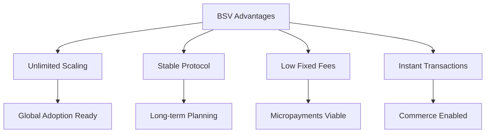
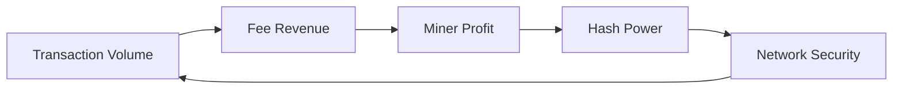

# Why BSV?

## The Competitive Advantages and Unique Value Proposition

This page explains why BSV stands out in the blockchain landscape and why it's the optimal choice for various use cases.

## 🎯 Executive Summary

BSV is the only blockchain that:
- **Scales unboundedly** while maintaining decentralization
- **Keeps fees at fractions of a cent** regardless of network usage
- **Provides a stable protocol** for long-term development
- **Enables instant transactions** for real-world commerce
- **Supports complex data applications** beyond simple payments
- **Works within legal frameworks** for enterprise adoption

## 📊 BSV vs Other Blockchains

### Comparative Analysis

| Feature | BSV | BTC | ETH | Others |
|---------|-----|-----|-----|---------|
| **Transaction Cost** | <$0.001 | $2-50 | $5-100 | Varies |
| **Throughput** | Unlimited* | 7 TPS | 15 TPS | Limited |
| **Block Size** | Unlimited | 1-4 MB | ~2 MB | Limited |
| **Smart Contracts** | Native Script | Limited | Solidity | Various |
| **Protocol Stability** | Locked | Changes | Changes | Changes |
| **Data Storage** | On-chain | Off-chain | Expensive | Limited |
| **Enterprise Ready** | Yes | No | Partial | Varies |

*Demonstrated 50,000+ TPS, designed for millions

### Technical Advantages



## 💡 Unique Capabilities

### 1. **True Micropayments**

BSV is the only blockchain where micropayments are economically viable:

```javascript
// Other chains: Fee > Payment (impossible)
// BSV: Fee < 0.01% of payment (always viable)

const payment = 0.001; // $0.001 payment
const bsvFee = 0.000001; // $0.000001 fee
const efficiency = ((payment - bsvFee) / payment) * 100;
// Result: 99.9% efficiency
```

**Use Cases Enabled:**
- Pay-per-article reading
- API usage billing
- IoT device communication
- Gaming microtransactions
- Content monetization

### 2. **Unlimited Data Storage**

Store data directly on-chain affordably:

| Data Type | Size | Cost | Use Case |
|-----------|------|------|----------|
| **Hash** | 32 bytes | <$0.001 | Timestamping |
| **Document** | 10 KB | <$0.01 | Contracts |
| **Image** | 1 MB | <$0.50 | NFTs |
| **Video** | 100 MB | <$50 | Media rights |

### 3. **Complex Smart Contracts**

Native scripting without separate VMs:
- No gas fees surprises
- Deterministic execution
- Turing complete (with payment)
- Audit-friendly code

### 4. **Enterprise Compliance**

Built for business requirements:
- Full audit trails
- Identity integration
- Regulatory compliance
- Privacy with transparency
- Legal framework compatible

## 🚀 Real-World Performance

### Proven at Scale

BSV has demonstrated capabilities that other chains only promise:

1. **4GB blocks** mined on mainnet
2. **50,000+ TPS** sustained throughput
3. **2 billion transactions** in a single block
4. **Sub-second** transaction propagation
5. **$0.0001** median transaction fee

### Network Statistics

```
Current Network Capacity:
├── Block Generation: ~10 minutes
├── Average Block Size: Growing with demand
├── Transaction Volume: Millions daily
├── Node Requirements: Professional hardware
└── Network Security: Highest SHA-256 hashrate
```

## 🏢 Business Benefits

### For Enterprises

1. **Predictable Costs**
   - Fixed fee structure
   - No congestion pricing
   - Budget with confidence

2. **Regulatory Compliance**
   - KYC/AML compatible
   - Audit trail built-in
   - Legal clarity

3. **Integration Friendly**
   - RESTful APIs
   - Standard protocols
   - Enterprise tools

4. **Future Proof**
   - Stable protocol
   - No breaking changes
   - Long-term planning

### For Startups

1. **Low Barrier to Entry**
   - Minimal infrastructure
   - Cheap transactions
   - Global reach

2. **New Business Models**
   - Micropayment economy
   - Data monetization
   - Token ecosystems

3. **Rapid Development**
   - Extensive tooling
   - Active community
   - Production examples

## 🔬 Technical Deep Dive

### Why Unlimited Scaling Works

1. **Economic Incentives Align**
   ```
   More transactions → More fees → More miners
   More miners → More capacity → Lower fees
   ```

2. **Hardware Keeps Improving**
   - CPU: Moore's Law continues
   - Storage: Cost drops exponentially
   - Network: Bandwidth increases
   - BSV: Leverages all improvements

3. **Parallel Processing**
   - UTXO model enables parallelism
   - No global state bottleneck
   - Linear scaling with cores

### Protocol Stability Matters

**Other chains:** Constant protocol changes
- Breaks applications
- Requires maintenance
- Creates uncertainty

**BSV:** Locked protocol
- Build once, run forever
- No surprise upgrades
- Investment protection

## 🌍 Ecosystem Advantages

### Developer Experience

```javascript
// Simple BSV transaction
const tx = new Transaction()
  .from(utxo)
  .to(address, amount)
  .sign(privateKey);

// No complex gas calculations
// No layer 2 complexity
// No protocol workarounds
```

### Infrastructure Maturity

- **Wallets**: Desktop, mobile, web
- **Libraries**: All major languages
- **Tools**: Explorers, debuggers
- **Services**: APIs, webhooks
- **Support**: Active community

## 📈 Economic Model

### Sustainable Security



As block rewards diminish:
- BTC/ETH: High fees required
- BSV: Volume compensates

### Fee Predictability

| Transaction Type | BSV Cost | BTC Cost | ETH Cost |
|-----------------|----------|----------|----------|
| Simple Payment | $0.0001 | $2-20 | $5-50 |
| Data Storage (1KB) | $0.001 | N/A | $100+ |
| Smart Contract | $0.001-0.01 | Limited | $20-200 |
| Token Transfer | $0.0001 | $2-20 | $10-100 |

## 🎯 Use Case Alignment

### Perfect For:

✅ **Micropayments** - Only viable option
✅ **Data Integrity** - Immutable storage
✅ **Supply Chain** - Track everything
✅ **IoT** - Machine-to-machine
✅ **Gaming** - In-game economies
✅ **Enterprise** - Compliance ready
✅ **Identity** - Self-sovereign
✅ **Tokens** - Without high fees

### Not Optimal For:

❌ **Illegal Activities** - Transparent ledger
❌ **Speculation Only** - Built for utility
❌ **Anonymous Usage** - Privacy, not anonymity

## 🔮 Future Outlook

### Ongoing Developments

1. **Teranode** - Million TPS architecture
2. **IPv6 Integration** - Direct peer connections
3. **Enterprise Tools** - Professional infrastructure
4. **Global Adoption** - Payment rails

### Network Effects

As adoption grows:
- More applications → More users
- More users → More value
- More value → More development
- More development → More applications

## ✅ Decision Framework

### Choose BSV When You Need:

- [ ] Transaction fees under $0.01
- [ ] More than 10 TPS throughput
- [ ] On-chain data storage
- [ ] Micropayment capability
- [ ] Regulatory compliance
- [ ] Long-term stability
- [ ] Instant transactions
- [ ] Global scale potential

### BSV is THE Choice For:

1. **Payment Systems** - Lowest fees, instant settlement
2. **Data Applications** - Affordable storage
3. **Enterprise Blockchain** - Compliance and scale
4. **IoT Networks** - Micropayments between devices
5. **Content Platforms** - Direct monetization
6. **Supply Chain** - Complete traceability
7. **Gaming** - Real money economies

## 📚 Evidence and Resources

### Case Studies
- [Micropayment Platform Success](../03-learning-pathways/business/case-studies.md)
- [Enterprise Implementation](../03-learning-pathways/enterprise/case-studies/)
- [Government Applications](../04-specialized-topics/implementation-strategies/)

### Technical Proof
- [Scaling Test Results](https://bitcoinscaling.io)
- [Fee Analysis](https://coin.dance/blocks/fees)
- [Performance Metrics](https://bsvdata.com/applications)

### Try It Yourself
- [Live Demos](../01-getting-started/live-demos.md)
- [Quick Start Examples](../01-getting-started/examples.md)
- [Hackathon Projects](../05-hackathon-pack/)

## 🎯 The Bottom Line

BSV is not just another blockchain - it's the realization of the original Bitcoin vision with:

1. **Proven scaling** beyond any other chain
2. **Fees low enough** for any use case
3. **Stability** for long-term development
4. **Compliance** for enterprise adoption
5. **Simplicity** in implementation

**Ready to build on the blockchain that actually works?**

→ Continue to [Ecosystem Overview](ecosystem-overview.md) to see what's being built on BSV.