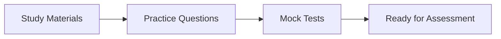

# BSV Knowledge Assessments

## Validate Your Learning and Skills

This section provides assessments to test your understanding of BSV concepts and validate your skills across different learning pathways.

## 📊 Assessment Overview

### Purpose
- **Validate Knowledge**: Confirm understanding of key concepts
- **Identify Gaps**: Discover areas for further study
- **Track Progress**: Measure learning advancement
- **Earn Recognition**: Obtain certificates of completion

### Assessment Types

| Type | Duration | Format | Purpose |
|------|----------|--------|---------|
| **Quick Check** | 5-10 min | Multiple choice | Concept verification |
| **Module Test** | 20-30 min | Mixed questions | Section completion |
| **Pathway Exam** | 60-90 min | Comprehensive | Pathway certification |
| **Practical Project** | 2-4 hours | Build something | Skill demonstration |

## 🎯 Assessment Framework

### Core Components
1. **[Assessment Framework](assessment-framework.md)** - Overall structure and methodology
2. **[Pathway Assessments](pathway-assessments/)** - Specific tests for each learning path
3. **[Certification Guide](certification-guide.md)** - How to earn certificates

## 📝 Available Assessments

### Foundation Assessments
Test your understanding of core BSV concepts:
- UTXO Model Basics
- Transaction Structure
- Proof of Work
- Fee Economics
- SPV Fundamentals

### Technical Pathway
For developers and builders:
- **Level 1**: Basic Development
  - Wallet integration
  - Simple transactions
  - API usage
  
- **Level 2**: Advanced Development
  - Smart contracts
  - Complex scripts
  - Performance optimization
  
- **Level 3**: Architecture
  - System design
  - Scaling strategies
  - Security implementation

### Business Pathway
For decision makers:
- Value Proposition Understanding
- ROI Calculations
- Use Case Selection
- Implementation Planning
- Risk Assessment

### Enterprise Pathway
For architects and compliance:
- Regulatory Compliance
- Integration Patterns
- Security Auditing
- Governance Models
- Deployment Strategies

### Academic Pathway
For researchers:
- Theoretical Foundations
- Cryptographic Principles
- Consensus Mechanisms
- Economic Models
- Research Methodologies

## 🏆 Certification Levels

### Bronze Certificate
- Complete foundation assessments
- Pass one pathway exam
- Submit one practical project

### Silver Certificate
- All bronze requirements
- Pass advanced assessments
- Complete peer review
- Contribute to community

### Gold Certificate
- All silver requirements
- Master-level project
- Mentor others
- Published work

## 📋 Assessment Process

### 1. Preparation


### 2. Taking Assessments
- **Environment**: Quiet, distraction-free
- **Resources**: Open book unless specified
- **Time Limits**: Strictly enforced
- **Attempts**: Usually 2-3 allowed

### 3. Scoring
- **Pass Mark**: 70% for certification
- **Feedback**: Detailed results provided
- **Retakes**: After 48-hour study period
- **Progress**: Tracked in profile

## 💡 Study Resources

### Recommended Preparation
1. **Review Materials**
   - Re-read pathway content
   - Watch video summaries
   - Practice with examples

2. **Hands-On Practice**
   - Build test projects
   - Run code examples
   - Experiment with tools

3. **Community Study**
   - Join study groups
   - Discuss concepts
   - Share knowledge

## 🎓 Sample Questions

### Foundation Level
**Q: What is a UTXO?**
- A) User Transaction eXchange Output
- B) Unspent Transaction Output ✓
- C) Universal Transfer Operation
- D) Unified Transaction Order

### Technical Level
**Q: How do you create a multi-signature transaction requiring 2 of 3 signatures?**
```javascript
// Provide code implementation
```

### Business Level
**Q: Calculate the ROI for implementing BSV micropayments in a content platform with 100,000 daily users.**
[Detailed calculation required]

## 📊 Performance Analytics

### Track Your Progress
- Overall completion: 75%
- Technical pathway: 90%
- Business understanding: 60%
- Practical projects: 3 completed

### Improvement Areas
Based on your assessments:
1. Smart contract development
2. Economic model understanding
3. Security best practices

## 🔧 Practical Projects

### Project Ideas by Level

#### Beginner
1. **Payment Gateway** - Accept BSV payments
2. **Data Notary** - Timestamp documents
3. **Token Creator** - Issue simple tokens

#### Intermediate
1. **DEX Interface** - Trading platform
2. **Identity System** - User management
3. **Supply Chain** - Track products

#### Advanced
1. **Layer 2 Solution** - Scaling implementation
2. **Privacy Protocol** - Enhanced privacy
3. **Cross-chain Bridge** - Interoperability

## 📅 Assessment Schedule

### Self-Paced
- Take assessments when ready
- No fixed deadlines
- Progress at your speed

### Scheduled Sessions
- Monthly certification exams
- Quarterly advanced assessments
- Annual master evaluations

## 🆘 Support Resources

### Getting Help
- **Study Guides**: Detailed preparation materials
- **Practice Tests**: Unlimited attempts
- **Mentor Support**: Book 1-on-1 sessions
- **Community Forums**: Peer assistance

### Common Issues
- **Test Anxiety**: Relaxation techniques
- **Technical Problems**: Support team available
- **Content Questions**: Instructor clarification
- **Time Management**: Practice strategies

## ✅ Next Steps

1. **Review** the [Assessment Framework](assessment-framework.md)
2. **Choose** your pathway assessment
3. **Prepare** using study resources
4. **Take** practice tests
5. **Schedule** your certification exam

## 🎯 Success Tips

### Do's
- ✅ Study consistently
- ✅ Practice hands-on
- ✅ Join study groups
- ✅ Ask questions
- ✅ Review mistakes

### Don'ts
- ❌ Cram last minute
- ❌ Skip prerequisites  
- ❌ Ignore feedback
- ❌ Rush through
- ❌ Give up easily

---

**Ready to test your knowledge?** Start with the foundation assessments and work your way up to pathway certification. Remember, assessments are learning tools - use them to guide your BSV journey!