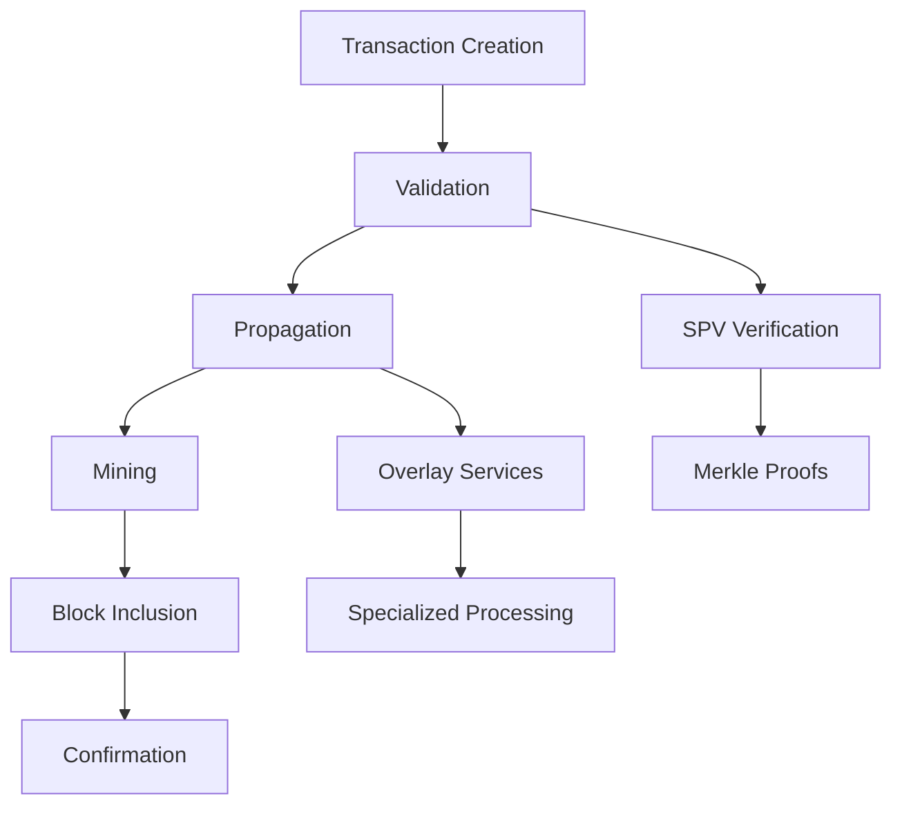

# BSV Ecosystem Components

## Complete Technical Reference

This section provides detailed documentation of all BSV ecosystem components, standards, and infrastructure elements. It serves as the authoritative technical reference for developers and architects.

## 📚 Component Categories

### Core Infrastructure
- **[BSV Components Overview](BSV_ECOSYSTEM_COMPONENTS.md)** - Comprehensive component documentation
- **[Component Implementation Plan](BSV_ECOSYSTEM_COMPONENTS_PLAN.md)** - Deployment strategies
- **[BRC Standards](brc-standards.md)** - Bitcoin Request for Comment standards

### Network Architecture
- **[Network Topology](network-topology.md)** - Node and network structure
- **[Mandala Network](mandala-network.md)** - Conceptual framework
- **[Overlay Services](overlay-services.md)** - Specialized service layers

### Protocol Standards
- **[Transaction Standards](transaction-standards.md)** - BRC-1, BRC-2, BRC-3
- **[Data Standards](data-standards.md)** - BEEF, BUMP, Atomic BEEF
- **[Identity Standards](identity-standards.md)** - Paymail, MetaID

### Governance Model
- **[Protocol Governance](governance-model.md)** - Decision-making structure
- **[Technical Standards Committee](tsc.md)** - Standards development
- **[Network Access Rules](network-access-rules.md)** - Participation requirements

## 🔧 Technical Components

### Transaction Processing



### Key Standards

| Standard | Purpose | Status |
|----------|---------|--------|
| **BRC-1** | Transaction format | Active |
| **BRC-2** | Envelope specification | Active |
| **BRC-3** | Merkle proof format | Active |
| **BRC-42** | Payload signatures | Active |
| **BRC-62** | BEEF format | Active |
| **BRC-74** | BUMP format | Active |
| **BRC-95** | Atomic BEEF | Draft |

## 🏗️ Infrastructure Layers

### 1. Base Protocol Layer
- Consensus rules
- Transaction validation
- Block production
- Network propagation

### 2. Service Layer
- Mining pools
- API services
- SPV servers
- Block explorers

### 3. Application Layer
- Wallets
- Development tools
- Business applications
- User interfaces

## 📡 Network Components

### Node Types

#### Mining Nodes
- Full validation
- Block creation
- Transaction selection
- Network security

#### Service Nodes
- API endpoints
- Data indexing
- SPV support
- Query services

#### Edge Nodes
- Light clients
- Mobile wallets
- Browser extensions
- IoT devices

### Communication Protocols

```
Node Communication Stack:
├── Application Protocol
├── Overlay Protocol
├── BSV Protocol
├── TCP/IP
└── Network Layer
```

## 🔐 Security Components

### Cryptographic Primitives
- SHA-256 hashing
- ECDSA signatures
- Merkle trees
- Script validation

### Security Layers
1. **Protocol Security** - Consensus rules
2. **Network Security** - Peer validation
3. **Transaction Security** - Script verification
4. **Application Security** - Best practices

## 📊 Data Structures

### Core Data Types

```javascript
// Transaction structure
{
  version: 2,
  inputs: [{
    prevTxId: "...",
    outputIndex: 0,
    script: "...",
    sequence: 0xFFFFFFFF
  }],
  outputs: [{
    satoshis: 50000,
    script: "..."
  }],
  nLockTime: 0
}

// Block structure
{
  header: {
    version: 1,
    prevBlock: "...",
    merkleRoot: "...",
    timestamp: 1234567890,
    bits: "...",
    nonce: 12345
  },
  transactions: [...]
}
```

## 🌐 Ecosystem Standards

### Application Protocols
1. **Paymail** - Human-readable addresses
2. **MetaNet** - On-chain data structure
3. **Run** - Token protocol
4. **Tokenized** - Security tokens

### Data Protocols
1. **B://** - Bitcoin data
2. **C://** - Content addressing
3. **D://** - Dynamic data
4. **MAP** - Magic Attribute Protocol

## 🔄 Integration Patterns

### Common Patterns

#### SPV Integration
```javascript
// Verify transaction with SPV
const proof = await getProof(txid);
const valid = await verifyProof(proof);
```

#### Overlay Service
```javascript
// Connect to overlay
const overlay = new OverlayService({
  type: 'tokens',
  network: 'mainnet'
});
```

#### Data Storage
```javascript
// Store data on-chain
const tx = new Transaction()
  .addData(['protocol', 'data', metadata])
  .sign(privateKey);
```

## 📈 Performance Metrics

### Network Capabilities
- **Transaction Throughput**: 50,000+ TPS demonstrated
- **Block Size**: Unlimited (4GB+ proven)
- **Propagation Time**: <3 seconds global
- **Confirmation Time**: ~10 minutes

### Scaling Metrics
- **Horizontal**: Add more nodes
- **Vertical**: Upgrade hardware
- **Parallel**: Process simultaneously
- **Optimized**: Efficient algorithms

## 🛠️ Development Tools

### Essential Tools
1. **BSV SDK** - Core development library
2. **sCrypt** - Smart contract language
3. **WhatsOnChain** - Block explorer
4. **mAPI** - Merchant API

### Testing Tools
1. **Regtest** - Local blockchain
2. **Testnet** - Public test network
3. **Mock Services** - API simulation
4. **Load Testing** - Performance validation

## 📚 Component Documentation

### Detailed Guides
- Transaction lifecycle
- Block validation process
- SPV implementation
- Overlay service creation
- Smart contract development

### Reference Materials
- API documentation
- Protocol specifications
- Code examples
- Best practices
- Security guidelines

## 🔗 External Resources

### Official Documentation
- [BSV Wiki](https://wiki.bitcoinsv.io)
- [Technical Standards](https://tsc.bitcoinassociation.net)
- [Developer Portal](https://docs.bitcoinsv.io)

### Community Resources
- GitHub repositories
- Discord channels
- Forum discussions
- Video tutorials

## ✅ Using This Reference

### For Developers
1. Understand component interactions
2. Implement standards correctly
3. Follow best practices
4. Test thoroughly

### For Architects
1. Design scalable systems
2. Choose appropriate components
3. Plan integrations
4. Ensure compliance

### For Researchers
1. Study protocol details
2. Analyze performance
3. Propose improvements
4. Contribute standards

---

**This section is continuously updated** as new standards and components are developed. Check back regularly for the latest technical specifications and ecosystem updates.